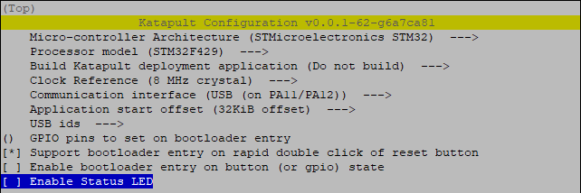
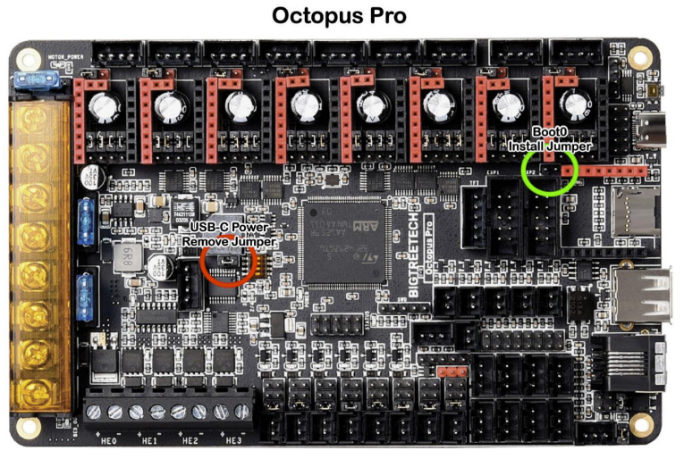
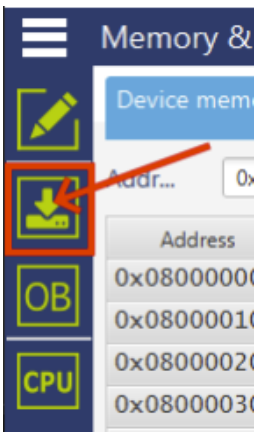
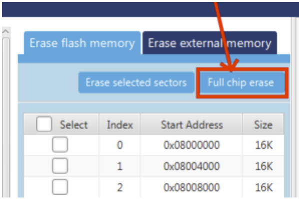
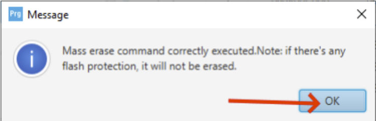
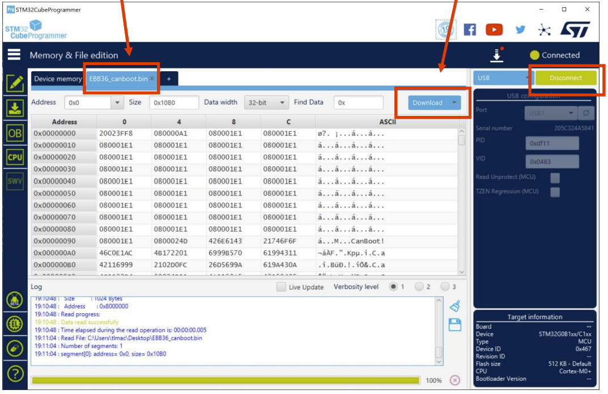
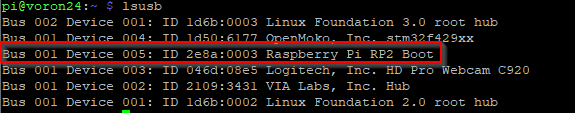
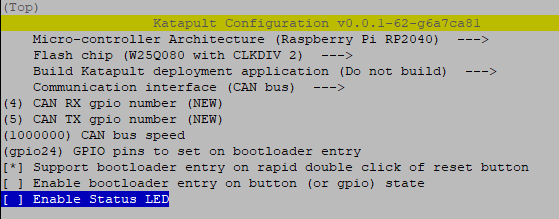
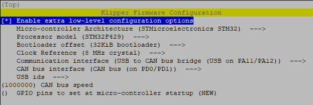
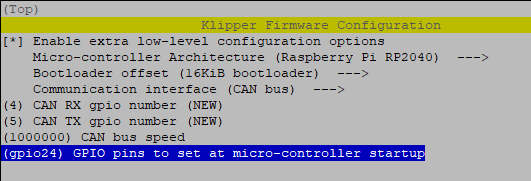

# Klipper_canbus_setup

## Introduction
This is my guide for how to setup Klipper on my Voron 2.4 350 to use canbus It focuses on Octopus Pro based on a F429 chip, and a Mellow Fly SB2040 EBB.
Its main purpose is for me to remember what I did, if i ever need to reinstall.

The content of this guide is based on information gathered from different sources, promarily these three:
- Akhamars great guide:  https://github.com/akhamar/voron_canbus_octopus_sb2040
- TeamFDM guide: [How to Use CAN Toolhead Boards Connected Directly to Octopus / Octopus Pro on CanBoot](https://www.teamfdm.com/forums/topic/672-how-to-use-can-toolhead-boards-connected-directly-to-octopus-octopus-pro-on-canboot/)
- TeamFDM toppic: [install canboot on sb2040](https://www.teamfdm.com/forums/topic/851-install-canboot-on-sb2040/)

For the move to Katapult instead of Canboot, this was used:
- https://www.teamfdm.com/forums/topic/2140-klipper-update-v0110-266-g261efdd8-and-octopus-canbus-sb2040-latest-aug-2023-update/
- https://github.com/Arksine/katapult

## Used hardware
- Raspberry Pi 4 with 32GB SD card.
- Bigtreetech Octopus Pro v1.0 with F429 chip
- Mellow Fly-SB2040 v1 board for StealthBurner

# Prerequisites
Download and install the following tools on PC
- [Raspberry Imager](https://www.raspberrypi.com/software/)
- [STM32CubeProgrammer](https://www.st.com/en/development-tools/stm32cubeprog.html)
- [PuTTY](https://www.putty.org/)

# Installation

## Raspberry OS
Start the Raspberry Imager on PC and insert SD card in reader

1. Click Choose OS and Select the "Raspberry Pi OS Lite (64-bit)" Image found under the Rasbberry PiOS (other) menu.
2. Change Settings by clicking the gear icon
   1. Set hostname to `voron24`
   2. Enable SSH, Use password authentication
   3. Set username and password
      1. leave username as `pi`
      2. set password
   4. Configure wireless LAN
      1. Set SSID
      2. Set password
      3. Set Wireless LAN country to `DK`
   5. Set locale settings
      1. Time zone: `Europe/Copenhagen`
      2. Keyboard layout: `dk`
3. Choose storage and Write.

Insert the SD card in the Pi and power up

## Install Klipper
Connect to the Pi using SSH (I use PuTTY for this)
Login as `pi`

Install Git and KIAUH (Klipper Installation And Update Helper)
```	
sudo apt-get install git -y
cd ~
git clone https://github.com/th33xitus/kiauh.git
./kiauh/kiauh.sh
```

Use KIAUH interface to install the following components (click 1 for install and follow instructions)
1. Klipper
2. Moonraker
3. Fluidd

## Configure Raspberry Pi as MCU
To be able to use Raspberry Pi as an MCU, and use it for input shaper, install Numpy package and dependencies.
```
~/klippy-env/bin/pip install -v numpy
sudo apt update
sudo apt install python3-numpy python3-matplotlib!
```
Enable Linux SPI driver on Rasbberry Pi, run `sudo raspi-config!` and under **Interface options** select **SPI** and then **Enable**, Save and exit.
Details on configuring the printer.cfg, refer to the [Klipper documentation](https://www.klipper3d.org/Measuring_Resonances.html#software-installation).

## Katapult (CanBoot) firmware
To utilize Katapult (previously CanBoot), we need to add Katapult firmware on the Octopus board and the SB2040 board.

### Clone repo
First we clone the Katapult repository
```
sudo su pi
cd ~
git clone https://github.com/Arksine/Katapult
```

### Katapult for octopus Pro

We will configure the firmware for the Octopus pro first
```
cd ~/Kataput
make menuconfig
```


> For F446 processor => `STM32F446` and `12 Mhz` 

> For F429 processor => `STM32F429` and `8 Mhz` (this is the board I have.)

And compile it
```
make
```

```
mkdir ~/firmware
mv ~/katapult/out/katapult.bin ~/firmware/octopus_1.1_katapult.bin
```

#### Flashing the image
This is where I ran into problems using Akhamars guide, as the F429 chip behaves differently. We can't flash in DFU mode from the Pi.
To get arround this, we use the STM32CubeProgrammer from the PC.

Copy the `~/firmware/octopus_1.1_katapult.bin` from Pi to local PC, using WinSCP or other tool.

First we need to configure the Octopus for DFU mode.
**Make sure the power is off to the Octopus board.**
1. Ensure the USB power jumper is removed (red circle)
2. place jumper on the boot0 header (green circle)



3. Connect the Octopus to PC using the USB-C on board to PC USB-A
4. Power the Octopus from 24v PSU
5. Start the STM32CubeProgrammer software on PC.

6. connect to board
At the top right corner, make sure USB is selected and then click **Connect**


You should now see a green "connected" message.


7. Chip erase

Go to the **Erasing & Programming** menu



Click the **Full chip erase** button



Confirm and wait for complete message.




Go back to the **Memory & File edition** menu



   1. Select **Open file** tab, find the `octopus_1.1_katapult.bin` file you copied from the Pi.
   2. Click the **Download** button
   3. Click **Disconnect**

8. Power off the board, and remove the jumper from boot0 header.

### katapult for SB2040
Set the sb2040 board to DFU. To do that, remove any power to the board, press the boot button while connecting the board to USB on the Pi.
The board should now be in DFU.

To confirm, do a `lsusb` and note down the ID of the device.



Configure the firmware
```
cd ~/katapult
make menuconfig
```


And compile it
```
make -j 4
```

Flash the firmware (note the Id is the one from the above step).
```
sudo make flash FLASH_DEVICE=2e8a:0003
```
The SB2040 is flashed and restarts. There should now be three solid blue LEDs turned on.
Disconnect the USB cable again.

## Octopus as USB to CAN bridge
To get the Octopus board working as an USB to CAN bridge, we need to install Klipper on the board.

### Create Klipper image
We will configure the firmware
```
cd ~/klipper
make menuconfig
```


And compile it
```
make
```

```
mv ~/klipper/out/klipper.bin ~/firmware/octopus_1.1_klipper.bin
```

### Flash image
```
ls -al /dev/serial/by-id
```
> Note the serial of the octopus Pro board

```
cd ~/katapult/scripts
pip3 install pyserial
python3 flash_can.py -f ~/firmware/octopus_1.1_klipper.bin -d /dev/serial/by-id/usb-katapult_stm32f429xx_310052000750314B33323220-if00
```

The board should now be flashed with a klipper can bridge.

## CAN Network
Next we need to create the can0 interface. This is needed before we can flash the sb2040 over CAN.

Create a new file using nano
```
sudo nano /etc/network/interfaces.d/can0
```

paste the following content
```
allow-hotplug can0
iface can0 can static
  bitrate 1000000
  up ifconfig $IFACE txqueuelen 1024
```
exit and save using CTRL+Q 

Power off/on everything

> check that the can network is now present
```
ip a
```
```
can0: <NOARP,UP,LOWER_UP,ECHO> mtu 16 qdisc pfifo_fast state UP group default qlen 1024
link/can
```

> Check for more details
```
ip -details -statistics link show can0
```
```
can0: <NOARP,UP,LOWER_UP,ECHO> mtu 16 qdisc pfifo_fast state UP mode DEFAULT group default qlen 1024
link/can  promiscuity 0 minmtu 0 maxmtu 0
can state ERROR-ACTIVE restart-ms 0
        bitrate 1000000 sample-point 0.750
        tq 62 prop-seg 5 phase-seg1 6 phase-seg2 4 sjw 1
        gs_usb: tseg1 1..16 tseg2 1..8 sjw 1..4 brp 1..1024 brp-inc 1
        clock 48000000
        re-started bus-errors arbit-lost error-warn error-pass bus-off
        0          0          0          0          0          0         numtxqueues 1 numrxqueues 1 gso_max_size 65536 gso_max_segs 65535
RX: bytes  packets  errors  dropped overrun mcast
11412      1551     0       0       0       0
TX: bytes  packets  errors  dropped carrier collsns
3568       641      0       0       0       0
```
## Klipper on SB2040
Now we should be able to install Klipper on the SB2040 using the can interface

### Create Klipper image
```
cd ~/klipper
make menuconfig
```


And compile it
```
make
```

```
mv ~/klipper/out/klipper.bin ~/firmware/sb2040_1.0_klipper.bin
```

### Flash image

First we need to find the UUID of the SB2040
```
cd ~/katapult/scripts
python3 flash_can.py -i can0 -q
```
Should give two devices, one is the Octopus (the one already running klipper), the one we need is the one running **katapult**
```
Resetting all bootloader node IDs...
Checking for katapult nodes...
Detected UUID: 6881ae241426, Application: Klipper
Detected UUID: 812c57297b3a, Application: katapult
Query Complete
```

> Note the two serial UUIDs and which is which, as you will need them when configuring the MCUs in Klippers printer.cfg.
>
> To differentiate which uuid correspond to which board, you can unplug the SB2040, that leaves you with just the Octopus bard.

**Note:** If the boards have previously been configured in klipper with their UUIDs, they will not show up if Klipper is already flashed to the device.

Replace the **<SERIAL_UUID>** with the serial found i above query.
```
python3 flash_can.py -i can0 -u <SERIAL_UUID> -f ~/firmware/sb2040_1.0_klipper.bin
python3 flash_can.py -i can0 -u 812c57297b3a -f ~/firmware/sb2040_1.0_klipper.bin
812c57297b3a
```

The board should now be flashed with klipper can.

Reboot the Pi

## Add katapult to Moonraker's update manager (optional):
```
[update_manager katapult]
type: git_repo
path: /home/pi/katapult
origin: https://github.com/Arksine/katapult.git
```
This will just keep the cloned repo updated - it won't automatically flash new bootloader versions.

## Klipper config
connect to Klipper using Fluid, and edit the printer.cfg file.


Klipper configuration example
> note that the uuids are the UUID values returned from the `flash_can.py` script we ran earlier.

```
[mcu]
canbus_uuid: c2ecdf459ba5

[mcu sb2040]
canbus_uuid: 685d07717632

...

[temperature_fan exhaust_fan]
...
sensor_pin: sb2040:gpio26

[temperature_sensor toolhead]
sensor_type: temperature_mcu
sensor_mcu: sb2040
min_temp: 0
max_temp: 100
```

>Note: if a pin is to be inverted, the `!` goes before the MCU like `sensor_pin: !sb2040:gpio26`


# Bigtreetech MMB CAN v1.0 ERCF board
## katapult for the ERCF MMB
Unplug the board for external power, and add the "VUSB" jumper to power board from USB.

Set the MBB board to DFU. To do that, remove any power to the board, press the boot button while connecting the board to USB on the Pi.
The board should now be in DFU.

To confirm, do a `lsusb` and note down the ID of the device.


Configure the firmware
```
cd ~/katapult
make menuconfig
```


And compile it
```
make -j 4
```

Flash the firmware (note the Id is the one from the above step).
```
sudo make flash FLASH_DEVICE=0483:df11
```

Move the new firmware file to the firmaware folder
```
mv ~/katapult/out/katapult.bin ~/firmware/mmb_katapult.bin
```
Copy the `~/firmware/mmb_katapult.bin` from Pi to local PC, using WinSCP or other tool.


The MMB is flashed and restarts.
Disconnect the USB cable again, remove the "VUSB" jumper and connect to CAN and power from printer.


