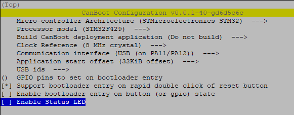

# voron_canbus_setup

## Introduction
This is my guide for how to setup Klipper on my Voron 2.4 350 to use canbus It focuses on Octopus Pro based on a F429 chip, and a Mellow Fly SB2040 EBB.
Its main purpose is for me to remebmer what I did, if i ever need to reinstall.

The content of this guide is based on information gathered from different sources, promarily these two:
- Akhamars great guide:  https://github.com/akhamar/voron_canbus_octopus_sb2040
- TeamFDM guide: [How to Use CAN Toolhead Boards Connected Directly to Octopus / Octopus Pro on CanBoot](https://www.teamfdm.com/forums/topic/672-how-to-use-can-toolhead-boards-connected-directly-to-octopus-octopus-pro-on-canboot/)

## Used hardware
- Raspberry Pi 4 with 32GB SD card.
- Bigtreetech Octopus Pro v1.0 with F429 chip
- Mellow Fly-SB2040 v1 board for StealthBurner

# Prerequisites
Download and install the following tools on PC
- [Raspberry Imager](https://www.raspberrypi.com/software/)
- [STM32CubeProgrammer](https://www.st.com/en/development-tools/stm32cubeprog.html)
- [PuTTY](https://www.putty.org/)

# Installation

## Raspberry OS
Start the Raspberry Imager on PC and insert SD card in reader

1. Click Choose OS and Select the "Raspberry Pi OS Lite (64-bit)" Image found under the Rasbberry PiOS (other) menu.
2. Change Settings by clicking the gear icon
   1. Set hostname to `voron24`
   2. Enable SSH, Use password authentication
   3. Set username and password
      1. leave username as `pi`
      2. set password
   4. Configure wireless LAN
      1. Set SSID
      2. Set password
      3. Set Wireless LAN country to `DK`
   5. Set locale settings
      1. Time zone: `Europe/Copenhagen`
      2. Keyboard layout: `dk`
3. Choose storage and Write.

Insert the SD card in the Pi and power up

## Install Klipper
Connect to the Pi using SSH (I use PuTTY for this)
Login as `pi`

Install Git and KIAUH (Klipper Installation And Update Helper)
```	
sudo apt-get install git -y
cd ~
git clone https://github.com/th33xitus/kiauh.git
./kiauh/kiauh.sh
```

Use KIAUH interface to install the following components (click 1 for install and follow instructions)
1. Klipper
2. Moonraker
3. Fluidd

## Configure Raspberry Pi as MCU
To be able to use Raspberry Pi as an MCU, and use it for input shaper, install Numpy package and dependencies.
```
~/klippy-env/bin/pip install -v numpy
sudo apt update
sudo apt install python3-numpy python3-matplotlib!
```
Enable Linux SPI driver on Rasbberry Pi, run `sudo raspi-config!` and under **Interface options** select **SPI** and then **Enable**, Save and exit.
Details on configuring the printer.cfg, refer to the [Klipper documentation](https://www.klipper3d.org/Measuring_Resonances.html#software-installation).

## CanBoot
To utilize CanBoot, we need to add CanBoot firmware on the Octopus board adn the SB2040 board.

### Clone repo
First we clone the CanBoot repository
```
sudo su pi
cd ~
git clone https://github.com/Arksine/CanBoot
```

### CanBoot for octopus Pro

We will configure the firmware for the Octopus pro first
```
cd ~/CanBoot
make menuconfig
```


> For F446 processor => `STM32F446` and `12 Mhz` 

> For F429 processor => `STM32F429` and `8 Mhz`

And compile it
```
make
```

```
mkdir ~/firmware
mv ~/CanBoot/out/canboot.bin ~/firmware/octopus_1.1_canboot.bin
```

#### Flashing the image
This is where I ran into problems using Akhamars guide, as the F429 chip behaves differently. We can't flash in DFU mode from the Pi.
To get arround this, we use the STM32CubeProgrammer from the PC.

Copy the `~/firmware/octopus_1.1_canboot.bin` from Pi to local PC, using WinSCP or other tool.

First we need to configure the Octopus for DFU mode.
**Make sure the power is off to the Octopus board.**
1. Ensure the USB power jumper is removed (red circle)
2. place jumper on the boot0 header (green circle)


3. Connect the Octopus to PC using the USB-C on board to PC USB-A
4. Power the Octopus from 24v PSU
5. Start the STM32CubeProgrammer software on PC.

6. connect to board
At the top right corner, make sure USB is selected and then click **Connect**


You should now see a green "connected" message.


7. Chip erase
Go to the Memory menu


Click the **Full chip erase** button


Confirm and wait for complete message.


Go back to the **Memory & File edition** menu

   1. Select **Open file** tab, find the `octopus_1.1_canboot.bin` file you copied from the Pi.
   2. Click the **Download** button
   3. Click **Disconnect**

8. Power off the board, adn remove the jumper from boot0 header.

### CanBoot for SB2040


